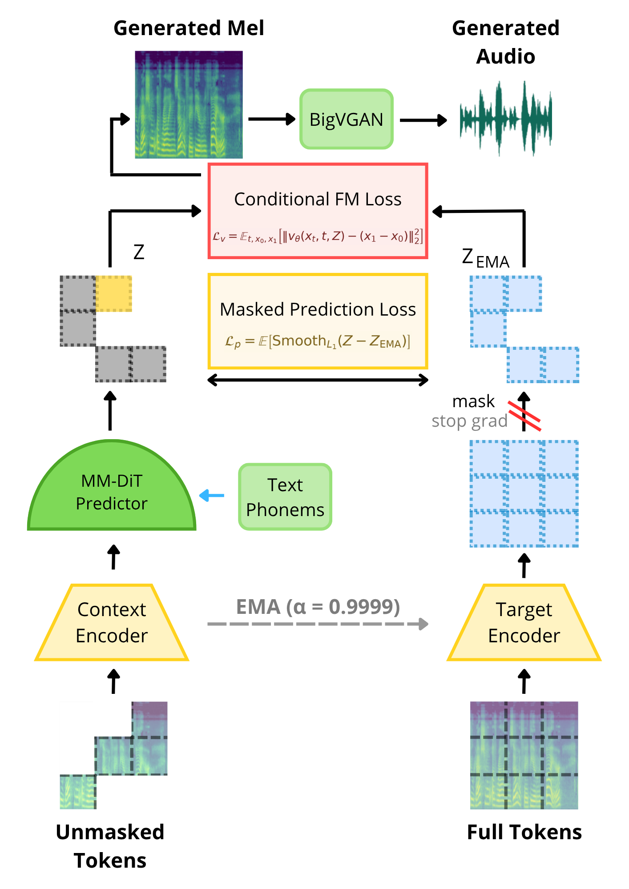
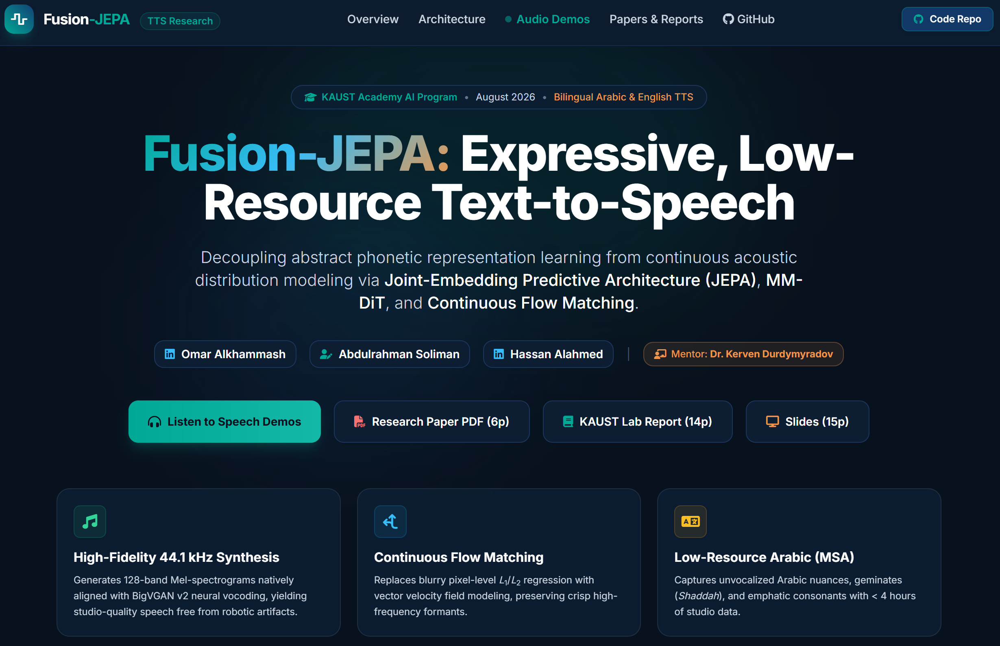

# Fusion-JEPA: Expressive, Low-Resource Text-to-Speech (TTS)

[](LICENSE)
[](https://omara32.github.io/Fusion-JEPA-TTS/)
[-E63946?style=for-the-badge&logo=adobe-acrobat-reader&logoColor=white)](https://omara32.github.io/Fusion-JEPA-TTS/reports/Fusion_JEPA_IEEE_Conference.pdf)
[-1D3557?style=for-the-badge&logo=overleaf&logoColor=white)](https://omara32.github.io/Fusion-JEPA-TTS/reports/Fusion_JEPA_KAUST_Report.pdf)
[](https://omara32.github.io/Fusion-JEPA-TTS/reports/Fusion_JEPA_Presentation.pdf)

> **Fusion-JEPA** is an open-source, bilingual Text-to-Speech (TTS) architecture that decouples abstract phonetic representation learning from continuous acoustic distribution modeling via **Joint-Embedding Predictive Architecture (JEPA)**, **Multimodal Diffusion Transformer (MM-DiT)**, and **Continuous Flow Matching**.

---

## Key Innovations

1. **Self-Supervised JEPA Latent Space ($\mathcal{L}_p$):**  
   An Exponential Moving Average (EMA, $\alpha=0.9999$) Target Teacher network encodes full acoustic spectrograms to provide stable target representations for the Predictor.
2. **Continuous Conditional Flow Matching ($\mathcal{L}_v$):**  
   Replaces blurry pixel-level $L_1/L_2$ regression with vector velocity field modeling, eliminating robotic buzzing and preserving sharp high-frequency harmonic formants.
3. **Multimodal Diffusion Transformer (MM-DiT) with 1D RoPE:**  
   Concatenates discrete phonemic text tokens and continuous acoustic patches into unified self-attention layers with 1D Rotary Position Embeddings for length-invariant temporal conditioning.
4. **Studio-Grade 44.1 kHz Vocoding:**  
   Generates 128-band Mel-spectrograms natively aligned with BigVGAN v2 neural vocoding (anti-aliased periodic Snake activations) for broadcast-quality waveform synthesis.
5. **Low-Resource Modern Standard Arabic (MSA):**  
   Learns complex Arabic phonetics, geminate consonants (*Shaddah*), and emphatic sounds with $< 4$ hours of studio data.

---

## Architecture

<p align="center">
  
</p>

---

## Interactive Audio Demos

Listen to side-by-side comparisons of **Ground Truth studio recordings** vs. **Fusion-JEPA generated speech** on our interactive GitHub Pages showcase:

<p align="center">
  <a href="https://omara32.github.io/Fusion-JEPA-TTS/">
    
  </a>
</p>

**[Explore Live Speech Showcase → https://omara32.github.io/Fusion-JEPA-TTS/](https://omara32.github.io/Fusion-JEPA-TTS/)**

---

## Quick Start

### 1. Installation

Clone the repository and install dependencies:

```bash
git clone https://github.com/OmarA32/Fusion-JEPA-TTS.git
cd Fusion-JEPA-TTS
```

**Windows:**
```bat
launchers\setup_env.bat
```

**Linux / Mac:**
```bash
bash launchers/setup_env.sh
```

---

### 2. Speech Synthesis (Inference)

Generate speech from arbitrary text or dataset index using BigVGAN v2 vocoding:

```bash
# Arabic Synthesis
python inference.py --lang arabic --text "وَتَتَضَمَّنُ حَفَلَاتٍ لِمُوسِيقَى الْجَازِ"

# English Synthesis
python inference.py --lang english --text "This is Fusion JEPA text to speech synthesis."

# Synthesize by dataset index (LJSpeech or Nawar Halabi)
python inference.py --lang english --db ljspeech --index 71
```

---

### 3. Model Training

Train the dual-loss Fusion-JEPA architecture with PyTorch Lightning:

```bash
# Train on Arabic Speech Corpus (Nawar Halabi)
python train.py --lang arabic --db nawar_halabi --checkpointnum 5

# Train on LJSpeech (English)
python train.py --lang english --db ljspeech --checkpointnum 5
```

---

### 4. Overfitting Verification Protocol

To verify architecture convergence and eliminate representation collapse before full cluster scaling:

```bash
python overfit_test.py --lang english --epochs 500
python overfit_test.py --lang arabic --epochs 500
```

---

## Repository Structure

```text
├── models/                     # Fusion-JEPA Model Implementations
│   ├── block.py                # MM-DiT & 1D RoPE Attention Blocks
│   ├── jepa.py                 # Core Fusion-JEPA Architecture
│   └── jepa_lightning.py       # PyTorch Lightning Module with Lv + Lp loss
├── data/                       # Dataset Loaders & Tokenizers
│   ├── dataset.py              # Mel-spectrogram extraction & phoneme tokenization
│   └── buckwalter.py           # Arabic orthographic transliteration tools
├── BigVGAN/                    # NVIDIA BigVGAN v2 Neural Vocoder (44.1kHz Universal)
├── launchers/                  # Automated Shell & Batch Environment Wrappers
├── train.py                    # Main Multi-GPU Training Script (PyTorch Lightning)
├── inference.py                # Audio Generation & Waveform Synthesis
├── overfit_test.py             # Empirical Overfitting Verification Suite
└── supercomputer_training.ipynb# Distributed Multi-GPU Cluster Notebook
```

---

## Authors

- **Omar Alkhammash** — King Khalid University / KAUST Academy
- **Abdulrahman Soliman** — KAUST Academy
- **Hassan Alahmed** — KAUST Academy
- **Mentor:** **Dr. Kerven Durdymyradov** — KAUST Academy AI Program

*Developed as part of the **KAUST Academy Artificial Intelligence Program** (August 2026).*

---

## Acknowledgments & Prior Work

We gratefully acknowledge the foundational open-source models, reference codebases, and datasets that made this work possible:

- **D-JEPA Codebase & Formulation:** [D-JEPA/djepa-imagenet](https://github.com/D-JEPA/djepa-imagenet) (Hao Chen et al., *D-JEPA: Denoising with a Joint-Embedding Predictive Architecture*, 2024) — which established the generative JEPA paradigm with dual latent prediction and flow/diffusion objectives.
- **JEPA-T Architecture:** [justin-herry/JEPA-T](https://github.com/justin-herry/JEPA-T) (Siheng Wan, Jifeng Shen, Justin Herry et al., *JEPA-T: Joint-Embedding Predictive Architecture with Text Fusion*, 2025) — which provided the core architectural foundations for text-conditioned multimodal transformer prediction.
- **JEPA Theory & Self-Supervised Learning:** Yann LeCun (*A Path Towards Autonomous Machine Intelligence*, 2022) and Meta AI (*I-JEPA / V-JEPA*, Assran et al., 2023; Bardes et al., 2024).
- **Continuous Flow Matching:** Yaron Lipman, Ricky T. Q. Chen, Heli Ben-Hamu, Maximilian Nickel, Matthew Le (*Flow Matching for Generative Modeling*, ICLR 2023).
- **BigVGAN Neural Vocoder:** NVIDIA Corporation ([NVIDIA/BigVGAN](https://github.com/NVIDIA/BigVGAN), Sang-gil Lee et al., *BigVGAN-v2: Universal Neural Vocoder with Anti-Aliased Snake Activations*, 2024).
- **Arabic Speech Corpus:** Dr. Nawar Halabi ([Arabic Speech Corpus](http://en.arabicspeechcorpus.com/), University of Southampton, 2016).
- **English Benchmark:** Keith Ito and Linda Johnson ([The LJ Speech Dataset](https://keithito.com/LJ-Speech-Dataset/), 2017).

---

## Publications & Documentation

- **[Research Manuscript (PDF)](https://omara32.github.io/Fusion-JEPA-TTS/reports/Fusion_JEPA_IEEE_Conference.pdf)**: 6-page IEEE-format conference paper with mathematical derivations and benchmark evaluations.
- **[KAUST Lab Report (PDF)](https://omara32.github.io/Fusion-JEPA-TTS/reports/Fusion_JEPA_KAUST_Report.pdf)**: 14-page comprehensive technical report with implementation details and Slurm recipes.
- **[Presentation Slides (PDF)](https://omara32.github.io/Fusion-JEPA-TTS/reports/Fusion_JEPA_Presentation.pdf)**: 15-slide defense presentation.

---

## License

This project is licensed under the **MIT License** — see the [LICENSE](LICENSE) file for details.
